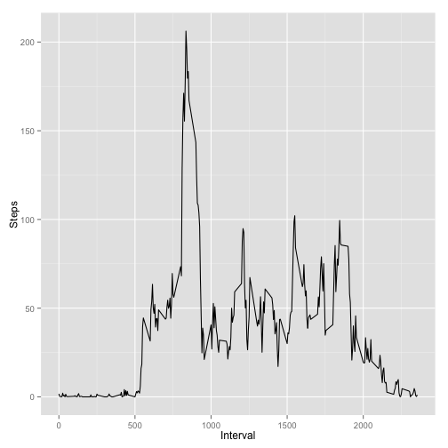
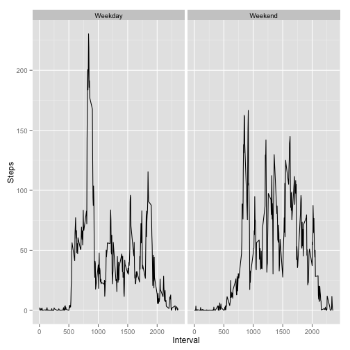

Reproducible Research: Peer Assessment 1
=================================================

###Part 1

The first step in the process is to read in the activity data from the activity.csv file.  Once the data is in, some preliminary cleaning is done to remove rows with missing data


```r
data <-read.csv("activity.csv")
data2 <-na.omit(data)
```

The *aggregate* function can take the data and sum by date, which is then used to create the histogram of the number of steps taken by day 


```r
histdata<- aggregate(data2$steps, by=list(data2$date), FUN=sum)
hist(histdata$x, main = "Histogram of Steps per Day",xlab = "Steps")
```

 

The mean and the median can then be calculated and printed

```r
mean <- mean(histdata$x)
median <- median(histdata$x)
print(mean); print(median)
```

```
## [1] 10766.19
```

```
## [1] 10765
```


###Part 2: Average Steps

In a similar fashion as Part 1, we can aggregate the data by time interval instead of date using the *aggregate* function.  Then, we can pass the resulting data frame some more suitable names.  Note that in this case, the mean calculation is done instea dof summing


```r
avginterval<- aggregate(data2$steps, by=list(data2$interval), FUN=mean)
names(avginterval)<-c("Interval","Steps")
```

To plot a time series of this data by time interval, load the ggplot2 library and use the ggplot function


```r
library(ggplot2)
```

```
## Need help? Try the ggplot2 mailing list: http://groups.google.com/group/ggplot2.
```

```r
ggplot(data=avginterval, aes(x=Interval, y=Steps, group=1)) + geom_line()
```

 

###Part 3: Imputing Missing Values

To begin with, this analysis aims to replace missing values with the average number of steps for the interval.  The first step here is to merge the original dataset (*data*) with the dataset containing the average steps by interval (*avginterval*)


```r
names(data) <- c("Steps", "Date", "Interval") 
data3 <- merge(data, avginterval, by= "Interval")
```

We can then replace the missing values with the average number of steps using the following code:


```r
data3$Steps.x[is.na(data3$Steps.x)] <- data3$Steps.y[is.na(data3$Steps.x)]
```

Then, following the same procedure as in Part 1, we can create the histogram of the total number of steps taken by day and print out the mean and median


```r
histdata2<- aggregate(data3$Steps.x, by=list(data3$Date), FUN=sum)
hist(histdata2$x, main = "Histogram of Steps per Day, Adjusted",xlab = "Steps")
```

 


```r
mean2 <- mean(histdata2$x)
median2 <- median(histdata2$x)
print(mean2); print(median2)
```

```
## [1] 10766.19
```

```
## [1] 10766.19
```

###Part 4: Weekend and Weekday Patterns

The first step here is to create an indicator variable that signals whether or not the date is a weekday or weekend.  Using the *weekdays* function, we can assign a day of the week to each entry.  The rest of the following code is designed to identify weekdays versus weekends and assign the appropriate label to a new variable called *Weekend* in the data set.


```r
data3$Day <- weekdays(as.Date(data3$Date))

weekend <- c("Saturday","Sunday")
data3$Weekend <- as.numeric(data3$Day %in% weekend)
data3$Weekend[data3$Weekend == 1] <- "Weekend"
data3$Weekend[data3$Weekend == 0] <- "Weekday"
```

We can then aggregate the data by weekend status and interval and calculate the mean by adding another level to the *aggregate* function


```r
avginterval2<- aggregate(data3$Steps.x, by=list(data3$Interval,data3$Weekend), FUN=mean)
names(avginterval2)<-c("Interval","Weekend", "Steps")
```

Lastly, using the *ggplot* function again, we can create 2 seperate time series plots by weekday status by adding a facet wrap to the ggplot command


```r
ggplot(data=avginterval2, aes(x=Interval, y=Steps, group=1)) + geom_line() + facet_wrap(~Weekend)
```

 
